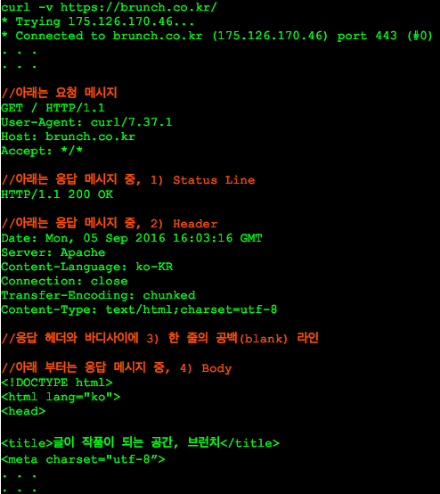

HTTP 2.0
=========

등장배경
--------
    HTTP 1.1의 포멧은 구현의 단순성과 접근성에 주안점을 두고 최적화 하다보니
    성능은 어느 정도 희생시켰다.
> HTTP의 메세지 교환 방식은 응답을 받아야만 요청을 보낼 수 있기 때문에 심각한 지연을 피할 수 없다.

위와 같은 문제점을 해결하기 위해 여럿 회사들이 다른 프로토콜을 만들었는데

**그중에 구글이 개발한 [SPDY](https://ko.wikipedia.org/wiki/SPDY)를 기반으로 HTTP/2.0 을 만들기 시작했다.**

HTTP 2.0 원리
-------------------
1. SV와 CL 사이의 TCP 커넥션 위에서 동작

2. 요청, 응답은 길이가 정의된 한 개 이상의 프레임에 담는다.
    * **HTTP Header**는 압축되어 담김.

3. 프레임에 담긴 요청과 응답은 스트림을 통해 보내진다.

### Frame과 Stream 에 대한 설명
    HTTP 1.1 이상에서는 요청, 응답은 메시지라는 단위로 구성이 되어있음
    메시지는 Status Line, Header 와 Body (data, payload로 표현하기도 함)

#### 응답 메시지 구성 요소

    HTTP/2.0 에서는 메시지라는 단위외의 Frame과 Stream 이라는 단위가 추가 되었다.
* Frame
  * HTTP/2.0 통신상의 제일 작은 정보의 단위이며, Header 혹은 Data 둘 중 하나.
* Message
  * HTTP/1.1과 마찬가지로 요청 혹은 응답의 단위이며, 다수의 Frame으로 이루어짐
* Stream
  * CL과 SV 사이에 맺어진 연결을 통해 양방향으로 주고받는 하나 혹은 복수개의 메시지

> 즉 여러개의 Frame이 모여 Message가 되고, 또 Message가 모여 Stream이 되는 구조이다.

#### HTTP/2.0 Stream 과정

### 멀티 플렉싱

  기존 HTTP/1.1 에서도 하나의 커넥션에 여러개의 요청을 KEEP-ALIVE으로 보낼 수 있었지만. 요청을 보낸 순서대로 응답을 해야한다는 문제점이 있었다.

> 하지만, HTTP/2.0 에서는 하나의 커넥션에 여러개의 스트림이 동시에 열릴 수 있다.

    순서와 관계 없이 응답을 받을 수 있다.

  또한 스트림은 우선순위를 가질 수 있어서, 중요한 리소스를 요청하는 스트림에게 더 높은 우선순위를 부여할 수 있을 것이다.

### 헤더 압축
    HTTP/1.0 에서는 압축을 하지 않고 전송이 되었다.
> 과거에는 웹페이지 하나를 방문할 때의 요청이 많지 않았기 때문.

요즘은, 웹페이지 하나를 보기 위해 수십에서 수백 번의 요청을 보내기 때문에 영향을 미친다.

**그래서, HTTP/2.0에서는 HPACK 명세에 정의된 헤더 압축 방법으로 압축한 뒤
'헤더 블록 조각'들로 쪼개져서 전송된다.**

### 서버 푸시
    CL가 SV에게 HTML 파일을 요청할때, 해당 HTML 파일과 관련이 있는 파일들을
    클라이언트에게 PUSH 하는 것.

> 클라이언트가, HTML 문서를 파싱해서 필요한 리소스를 다시 요청하여 발생하게 되는 프래픽과 회전 지연을 줄여준다.

보안이슈
--------
### 중개자 캡슐화 공격
HTTP/2.0 중간의 프록시가 HTTP/1.1로 변환할 때 메시지의 의미가 변질될 가능성이 있다.

    HTTP/1.1과 달리 HTTP/2.0은 헤더 필드의 이름과 값을 바이너리로 인코딩하기 때문.

> 정상적인 HTTP/2.0 요청이나 응답이 위조된 HTTP/1.1 메시지로 번역되는 것을 유발

### 긴 커넥션 유지로 인한 개인정보 누출 우려
HTTP/2.0은 사용자가 요청을 보낼 때의 회전 지연을 줄이기 위해 클라이언트와 서버 사이에 **오래 유지하는 것을** 염두에 두고 있음

> 물론, 기존 HTTP가 현재 갖고 있는 문제이기도 하지만, 짧게 유지되는 커넥션에는 위험이 적다.